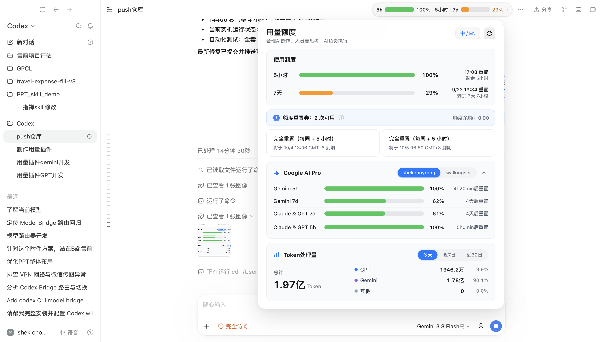

 # Codex Quota Header (额度看板插件)
 
 > 为 Codex / ChatGPT 桌面客户端打造的原生质感顶栏用量看板，额度与重置倒计时一目了然。
 
 
 
 ---
 
 ## 痛点与由来
 
 日常深度使用 Codex 或 ChatGPT 桌面客户端时，大家往往会遇到这些困扰：
 
 - 代码写得正投入，突然提示额度耗尽被限流，打断专注心流；
 - 不清楚 5 小时滚动额度和 7 天每周限额各自还剩多少；
 - 想看下一次额度刷新时间，每次都要打开设置翻找，或者心里默默估算。
 
 **Codex Quota Header** 把额度监控直接做进了客户端的顶部导航栏。像原生系统功能一样，以精致的胶囊与卡片形式常驻显示剩余百分比与重置倒计时，彻底告别“用量盲盒”。
 
 ---
 
 ## 核心功能亮点
 
 ### 1. 浑然一体的 Apple 质感设计
 采用 macOS 风格的磨砂毛玻璃半透明胶囊，完美融入官方暗色/明色界面。通过智能安全锚点插入在会话标题与右侧操作区之间，绝不遮挡聊天菜单（`...`）、分享、置顶及右侧面板按钮。
 
### 2. 额度与倒计时一眼尽览
- **5h 滚动用量**：直观展示当前 5 小时滚动窗口的剩余额度比例与进度槽；
- **7d 每周限额**：实时追踪 7 天长效周期的剩余用量；
 - **胶囊极简纯粹**：去除尾部冗余小箭头，右侧以 7 天用量百分比规整收尾，视觉更聚焦核心指标；
- **健康度色阶**：按剩余比例统一着色：41%–100% 为绿色（`#34C759`），11%–40% 为黄色/橙色（`#FF9500`），0%–10% 为红色（`#FF3B30`），无数据为灰色（`#8E8E93`）。
- **周限额耗尽联动机制**：7 天周限额作为账号总天花板，一旦周限额耗尽（剩余 0%），5 小时短窗口自动联动归一化为 0% 红色告警，防止产生“短窗口还有额度却无法调用”的误判，同时仍保留各自独立的重置时刻。

### 3. 极简轻量下拉卡片（V3 UI 焕新）
鼠标移动到胶囊上方（Hover）或点击胶囊（Click）即可唤起详情卡片。离开延时 240ms 防误触闪退，支持点击外部或按 `Esc` 快速关闭：
- **协作标语**：“合理AI协作，人员负责思考，AI负责执行”；
- **中英双语即时切换**：右上角 `中 / EN` 按钮内置状态高亮感知（选中文高亮“中”，选英文高亮“EN”），所有倒计时与文案实时生效并记忆；
- **主额度四列规范排版**：采用统一清晰的「名称 | 进度条 | 百分比 | 重置信息」四列对齐，彻底移除行首多余小图标与重复百分比文字，视觉极为规整；
- **右上角专属重置券开关（`🎫`）**：默认保持收起隐藏，普通界面极度清爽；点击右上角 `🎫` 图标即可按需开启。关闭时自动传递 `{ excludeResetCreditDetails: true }` 暂停查询重置卡内容，零额外拉取开销；开启时即时发起查询并呈现最新可用券与到期明细；
- **一体化额度券模块**：整体收归至统一卡片容器，与各模块背景色（`#F9FAFB`）保持一致，彻底杜绝浮动割裂感；去除了多余的提示图标，内嵌双列并排陈列重置券到期时间与余额；当无可用券时自动呈现专属票券空状态；
- **轻阴影轻质感**：面板宽度紧凑控制在约 600px，轻量卡片层次分明，与顶部胶囊右对齐，绝不侵入遮挡主体编辑区。

### 4. Google AI Pro 额度模块（通用化按需开启 & 自动故障转移）
针对多模型协作生态，详情卡片配备高扩展性的 **Google AI Pro** 配额模块：
- **右上角专属配置开关（`✦`）**：默认保持关闭，普通用户界面极致紧凑；点击右上角 `✦` 图标即可按需开启。关闭时不发起任何代理轮询，0 资源开销；
- **自动探测本地账号**：开启时自动读取本地是否存在配置账号，无账号时给出轻量友好提示，有账号时自动呈现；
- **优先级感知与自动故障转移**：智能解析本地凭证优先级（`priority`），首次打开默认高亮并展示当前生效的主路由账号（如高优先级的 `walkingscr`）；当主账号额度耗尽且底层路由切换时，前端看板**自动同步切换并高亮选中备用账号**；
- **模块折叠 / 展开**：标题右侧提供折叠箭头，展开/收起自由掌控；
- **实时动态倒计时**：前端根据配额重置时刻秒级实时重算递减，并受 5h 封顶保护；配额到期后自动静默拉取远端恢复状态。

### 5. 全景 Token 使用量统计（按需开启 & 三大周期）
零外部数据库、零网络上传，纯本地增量轻量解析 Codex 的会话日志：
- **右上角专属配置开关（`📊`）**：默认保持收起隐藏，界面极致紧凑；点击右上角图表按钮即可按需开启；关闭时暂停轮询扫描，零额外开销；
- **三大周期秒级切换**：支持自由无感切换「今天」、「近 7 日」和「近 30 日」的 Token 消耗；
- **全局汇总与型号下钻**：总计始终表示所选时间范围内全部 Token；“模型”下拉默认含「汇总、GPT、Gemini」，其他模型系列只在当前周期有用量时加入。选中系列后展示该系列小计和各型号用量；系列占比以全局总计为分母，型号占比以该系列小计为分母；
- **超类别收纳**：汇总最多显示 4 行；超过 4 个有用量的系列时，单列 GPT、Gemini 和用量最高的另一个系列，第 4 个及之后合并为「其他模型合计（N 类）」。下拉仍逐项列出所有有用量系列，合计行不是筛选项；
- **分类口径与切换**：GPT、Gemini 固定可选；GLM、DeepSeek、Claude、MiniMax 按型号前缀归类；未知型号进入“其他”。切换周期后若当前所选系列没有数据，选择自动回到“汇总”。选择模型只对现有内存汇总重新分组，不触发额外文件扫描或网络请求；
- **一致性与口径**：总计等于分类之和，分类小计等于型号之和；GPT 和 Gemini 即使当前为 0 仍保留。统计值来自本机 Codex rollout 日志的用量增量，可能包含重复上下文处理量，不等同账单或去重后的文本 Token；
- **中英单位自然适配**：中文环境下以符合中文习惯的「万 / 亿」展示（如 `3754万`、`1.22亿`），英文环境下自动保持「K / M / B」（如 `37.54M`、`1.22B`）；
- **极速低资源占用**：首启后台分片异步建立 32 天每日型号汇总，日常每 30 秒仅增量读取新增日志；切换时间范围和模型分类完全在内存中计算，不额外读文件或发网络请求。

### 6. 智能自适应窗口缩放
拖动窗口变大变小？组件内置响应式逻辑，自动在四种形态之间平滑切换（Full 全功能 → Compact 紧凑 → Minimal 极简 → Nano 微缩）。即便在超窄窗口下，依然保留核心额度饼图，绝不破坏界面布局。

### 7. 全组件联动 Loading 刷新反馈
顶栏展开后点击右上角刷新图标即可触发全量更新（包括主额度、重置券、当前 Google 账号用量及 Token 汇总）。刷新过程中旧数据完好保留，Refresh 图标持续旋转高亮，弹窗内所有百分比、倒计时、Token 消耗量等关键数字与进度槽均联动呈现 Apple HIG 呼吸微光 Loading 动效，数据到达后平滑还原，杜绝白屏与闪烁。

### 8. 精致统一空状态设计
额度券（0 次可用）、Google AI Pro（未配置账号/无数据）、Token使用量（暂无记录）均配备专属定制图标与居中圆角卡片，视觉优雅统一。

### 9. 智能会员适配
 自动识别会员类型：Plus 账号展示 5 小时滚动与 7 天周期窗口，其他会员类型自适应展示 7 天窗口，按需呈现核心指标。

### 10. 纯本地安全机制与智能自愈
 额度读取由后台进程直接通过 Codex App Server、CLIProxyAPI 及本地回环接口完成，渲染器只接收脱敏后的额度与 Token 统计快照；OAuth Token 和管理密钥仅在后台本机读取并用于必要请求，不会传入页面、不写入插件日志，也不会将数据上传至第三方服务器。对话正文不参与 Google 配额读取。Chat 对话页、新对话页、任务会话切换以及页面软硬刷新均支持自动检测与补挂载。

---
 
 ## 快速安装与上手
 
 ### 运行环境要求
 - 操作系统：macOS
 - 运行环境：已安装 [Node.js](https://nodejs.org/)（v18 或更高版本）
 - 客户端：已安装 Codex 或 ChatGPT 桌面客户端（ChatGPT.app）
 
 ### 第一步：一键安装
 
 打开 Mac 终端，进入本插件目录并运行安装脚本：
 
 ```bash
 ./bin/install.sh
 ```
 
 安装脚本会自动完成以下设置：
 1. 复制插件至扩展目录 `~/.codex/plugins/codex-usage-header`；
 2. 安装终端命令 `~/.local/bin/codex-header`；
 3. 在“应用程序”目录生成 **`Codex Quota Header.app`** 快捷启动器。
 
 ### 第二步：日常启动与使用（零门槛免终端）
 
 安装完成后，你**完全不需要**每次都在终端敲命令：
 
1. 打开访达（Finder）的 **“应用程序 (Applications)”** 目录，找到 **`Codex Quota Header.app`**；
2. （强烈建议）将它直接**拖到 Mac 底部的 Dock 栏**；
3. 以后直接点击该图标启动即可！它会自动唤起客户端并挂载顶栏额度胶囊。

> **温馨提示**：如果启动时 Codex 已经在普通模式下打开，启动器会自动帮其平滑重启并接入调试通道，无需你手动先去任务管理器或退出软件。

### 已安装用户：如何快速升级

如果你之前已经安装过本插件，想要获取最新的功能特性与体验优化，只需在克隆的仓库目录执行：

```bash
# 1. 拉取最新代码
git pull

# 2. 重新执行安装脚本覆盖更新
./bin/install.sh
```

> **免重启生效小贴士**：
> 运行安装脚本后，如果你的 Codex 客户端当前正开着，无需退出重开，直接在终端执行一行：
> ```bash
> codex-header --inject-only
> ```
> 顶栏组件便会瞬间自动重载为最新版本！或者下次直接通过 `Codex Quota Header.app` 启动也会自动生效。

## Google AI Pro 用量：新装前置条件与配置

### 先看结论

- **只使用 Codex 5 小时 / 7 天额度**：不需要 Google 账号，也不需要配置 Antigravity、CLIProxyAPI 或 Google OAuth。插件安装后即可使用。
- **显示 Google AI Pro 用量**：需要本机已有可用的 Antigravity OAuth 账号，并且本机的 CLIProxyAPI / Model Bridge 能正常工作。该模块默认关闭，打开详情卡片右上角的 `✦` 开关后才会读取和轮询。
- **Token 处理量统计**：不依赖 Google 账号，只读取本机 `~/.codex/sessions` 会话日志；首次开启可能需要后台建立本地汇总。

### Google AI Pro 的必要条件

新安装时，Google 用量模块至少需要满足以下条件：

1. macOS、Node.js 18+，以及已经安装并登录的 Codex / ChatGPT 桌面客户端。
2. 本机存在至少一个未禁用的 Antigravity OAuth 认证文件，默认目录和命名格式为：

   ```text
   ~/.cli-proxy-api/
   ├── config.yaml                 # 管理接口配置，可选但推荐
   └── antigravity-<account>.json  # Google OAuth 账号，必须有至少一个
   ```

   认证文件应包含有效的 `access_token`；如果希望自动续期，还必须有可用的 `refresh_token`。文件名为 `antigravity-*.json`，`.bak` 备份文件不会被读取。
3. OAuth 刷新所需的客户端凭证可用，满足以下任一方式即可：

   - 环境变量 `ANTIGRAVITY_CLIENT_ID` 与 `ANTIGRAVITY_CLIENT_SECRET`；
   - 本机已有的 Model Bridge 配置文件 `~/.config/codex-cli-model-bridge/codex-model-router.mjs` 中的同名配置。
4. 本机可访问以下地址：

   - CLIProxyAPI 回环服务：`http://127.0.0.1:8317`；
   - Google OAuth 刷新服务：`https://oauth2.googleapis.com`；
   - Google 配额服务：`https://daily-cloudcode-pa.googleapis.com`。

   CLIProxyAPI 端口以现有 Model Bridge 配置为准；如果已经有一套 bridge 在运行，不要为了插件再启动第二套实例或更换认证目录。
5. 推荐配置 CLIProxyAPI 的本机管理密钥，以便优先通过回环管理接口访问 Google 配额。可以在 `~/.cli-proxy-api/config.yaml` 配置 `remote-management.secret-key`，或通过环境变量 `MANAGEMENT_PASSWORD` 提供。管理密钥只应保存在本机，不能提交到 GitHub。

> 管理接口是推荐链路，不是 Codex 主额度的前置条件。当前插件在管理接口不可用时会尝试使用有效的 Google `access_token` 直连配额服务；但没有有效 OAuth 账号或账号已过期时，Google 模块仍然无法显示。

CLIProxyAPI 管理配置的结构示例（只填入你自己的本机密钥，不要照抄示例值）：

```yaml
remote-management:
  allow-remote: false
  secret-key: "<本机管理密钥>"
```

如果 bridge 已经有管理配置，保留原配置并只确认 `secret-key` 可用即可；不要为了插件重复创建配置文件。若没有 CLIProxyAPI / Antigravity 账号池，插件不会自动替你完成 Google OAuth 登录，需先完成 bridge 自身的登录流程。

### 推荐配置方式：复用已有 Antigravity / CLIProxyAPI

不要手工复制或粘贴 `access_token`、`refresh_token`、`client_secret`。新装插件时建议按下面顺序操作：

1. 先按现有 Antigravity / CLIProxyAPI 的登录流程登录 Google 账号，让 bridge 生成认证文件；插件会自动扫描 `~/.cli-proxy-api/antigravity-*.json`。
2. 确认 bridge 已启动并使用预期的 `8317` 回环端口。
3. 启动插件，展开用量卡片，点击右上角 `✦` 开启 **Google AI Pro**；如果还需要本地 Token 统计，再单独开启图表开关。
4. 首次开启后等待一次后台刷新，卡片中出现 `Gemini AI Pro` 及对应的 5h / 7d 行，即表示配置生效。关闭开关后不会继续轮询 Google 配额。

如果使用的是本机已有的 `codex-autoheal-bridge` / Model Bridge 配置，应继续使用它提供的登录、账号池和自愈流程；插件只消费其本地认证文件和配额结果，不额外创建账号池。

### 安全的只读检查

以下命令只检查目录、文件名和回环服务状态，不会打印 OAuth 内容。请不要把包含邮箱、Token 或管理密钥的完整终端输出贴到公开 Issue：

```bash
# 是否存在认证目录和配置文件
test -d "$HOME/.cli-proxy-api" && echo "auth dir: OK" || echo "auth dir: MISSING"
test -f "$HOME/.cli-proxy-api/config.yaml" && echo "config: OK" || echo "config: MISSING"

# 只列出认证文件名，不要打开或复制文件内容
find "$HOME/.cli-proxy-api" -maxdepth 1 -type f \
  -name 'antigravity-*.json' -not -name '*.bak' -print

# 检查本机 bridge 是否监听预期端口；HTTP 状态码为 2xx/4xx 均说明端口有响应
curl -sS -o /dev/null -w 'CLIProxyAPI: %{http_code}\n' \
  'http://127.0.0.1:8317/v1/models'

# 检查插件监控和注入状态
codex-header --status
```

### 配置文件和数据位置

| 内容 | 默认位置 | 说明 |
| --- | --- | --- |
| Antigravity OAuth 账号 | `~/.cli-proxy-api/antigravity-*.json` | 由 bridge 登录流程生成；不要手工写入或提交 |
| CLIProxyAPI 配置 | `~/.cli-proxy-api/config.yaml` | 可包含本机 `remote-management.secret-key`，必须保护权限 |
| Model Bridge 客户端凭证 | `~/.config/codex-cli-model-bridge/codex-model-router.mjs` 或环境变量 | 仅用于 OAuth 自动刷新 |
| 插件开关 | `~/Library/Application Support/Codex Quota Header/settings.json` | 保存 Google / Token 模块是否启用 |
| Token 本地汇总 | `~/Library/Application Support/Codex Quota Header/token-rollup.json` | 仅本机增量汇总，不上传网络 |
| Codex 会话日志 | `~/.codex/sessions` | Token 统计的本地数据源；缺少该目录时只影响 Token 统计 |

### Google 模块故障排查

| 现象 | 常见原因 | 处理方法 |
| --- | --- | --- |
| 显示“未配置账号 / 暂无数据” | 没有匹配的 `antigravity-*.json`，或账号被禁用 | 重新走 bridge 的 Google 登录流程，确认文件位于 `~/.cli-proxy-api/` 且不是 `.bak` |
| 显示 Token 过期、刷新失败 | `refresh_token` 无效，或 OAuth client id / secret 缺失 | 重新登录 Google；确认环境变量或 Model Bridge 配置中存在客户端凭证 |
| CLIProxyAPI 返回 401 | 管理密钥不匹配或服务未加载新配置 | 检查 `MANAGEMENT_PASSWORD` 与 `remote-management.secret-key`，修改后重启现有 bridge |
| CLIProxyAPI 无响应 | bridge 未启动、端口不是 8317，或启动了错误的认证目录 | 先检查现有 bridge 的启动配置；不要重复启动第二个实例 |
| Google 返回 403 / 429 | 账号资格、Google 服务策略、临时限流或上游配额问题 | 先用 bridge 自身的账号检查/登录流程验证；这不是 Codex 顶栏注入问题 |
| 数据暂时保持旧值 | 网络或 OAuth 刷新暂时失败 | 恢复网络或重新登录后点击卡片刷新；插件会保留最近一次有效快照，避免白屏 |
| Token 统计显示“建立中” | 首次正在扫描历史会话日志 | 等待后台完成；Google 账号配置不会影响 Token 统计 |

### 凭证安全边界

插件后台只在本机读取完成 Google 配额所需的认证文件和本地管理配置，并将请求发送到本机 CLIProxyAPI 或 Google 配额服务；这些凭证不会传入页面渲染器，也不会写入插件日志或上传到第三方服务器。请不要把以下内容写入 README、Issue、截图或 Git：

- `access_token`、`refresh_token`；
- `ANTIGRAVITY_CLIENT_SECRET`；
- `MANAGEMENT_PASSWORD` 或 `remote-management.secret-key`；
- 包含上述字段的完整 JSON / YAML 文件。

Google 配额接口使用的是上游内部配额端点，未来可能因 Google 或 bridge 版本变化而调整；即使 Google 模块不可用，Codex 自身的 5h / 7d 额度和插件注入功能仍应独立工作。

---

## 交互与操作说明
 
 - **查看悬停卡片**：将光标悬停在胶囊上展开详情，移出后自动收起；点击胶囊可在展开/关闭之间切换。
 - **键盘无障碍操作**：支持按 `Tab` 键聚焦胶囊，按 `Enter` 或 `Space` 展开，按 `Esc` 关闭。
 - **手动刷新数据**：展开卡片，点击第一行右侧刷新按钮；顶栏不显示刷新按钮。
- **重置券信息**：显示可用次数与每张重置券的到期日期，不绑定额外弹窗。
- **重置券图标**：使用本地压缩的绿色充值卡图标，资源大小控制在 100KB 以内。
- **语言切换**：卡片第一行可切换中英文，顶栏文案同步切换；自动刷新频率继续由程序配置文件控制。
 - **页面自动适配**：无论是在 Chat 对话页、普通任务会话、新建对话页，还是在不同页面间来回切换，组件都会智能识别并保持挂载；定位不到安全空间时不会覆盖客户端原生按钮。
 
 ---
 
 ## 常见问题 (FAQ)
 
 ### 1. 为什么要通过 `Codex Quota Header.app` 启动，而不是直接点原版客户端图标？
 官方客户端基于 Electron 构建，默认出于安全考虑关闭了前端界面的外部注入通道。`Codex Quota Header.app` 是一个专用的免终端启动器，它唯一的任务就是启动官方客户端时附带开启本机调试通道（CDP），从而将额度界面安全注入顶栏。它**完全不修改官方程序包内部的任何文件**，纯净无毒。
 
### 2. 打开提示“找不到 Node.js”怎么解决？
 插件后台监控进程需要使用 Node.js。Mac 自带的 Finder 环境有时不会读取终端环境变量，启动器已默认适配了 Homebrew 常见路径（`/opt/homebrew/bin/node` 与 `/usr/local/bin/node`）。
 如果你使用 nvm 或自定义路径管理 Node.js，可以在环境配置文件（如 `~/.zshrc`）中指定：
 ```bash
 export CODEX_USAGE_HEADER_NODE="/你的node实际路径"
 ```
 
### 3. 额度显示“不可用”或一直在加载？
 请检查当前 Codex 客户端是否已成功登录账号并连接网络。组件数据由后台通过 Codex App Server 读取，当未登录或离线时会显示不可用状态。登录成功后打开详情卡片，点击卡片右上角刷新按钮即可恢复。

### 4. 页面刷新、切换 Chat 对话或新建对话后组件暂时消失？
后台监控会检查当前 CDP 页面；发现页面已重载但组件未挂载时会自动重新注入。若客户端刚启动仍未显示，可运行 `codex-header --status` 查看通道，再运行 `codex-header --inject-only` 触发一次手动恢复。

### 5. 悬停组件没有弹出详情卡片？
顶栏属于 Codex 的原生拖拽区域，旧版本可能把鼠标悬停事件交给拖拽层，导致点击偶尔可用但悬停无反应。当前版本已为组件设置独立的可命中区域，并增加页面坐标兜底；安装后运行 `codex-header --status` 确认 `mountedCount` 为 `1`。若仍未显示，运行一次 `codex-header --inject-only` 即可重新注入，无需退出 Codex。

### 6. 如果 7 天周限额耗尽了，为什么 5 小时额度也会显示为 0%？
因为 7 天限额是整个账号的绝对上限。一旦每周总限额耗尽，即使用户在 5 小时短周期内还有理论余量，客户端也已无法发起任何新调用。为了避免给用户造成误导，组件会自动联动将有效剩余置为 0% 并呈现红色告警，同时仍会保留 5 小时和 7 天各自的重置时间倒计时。

### 7. 如何彻底卸载？
 如果不再需要此组件，在终端运行项目目录下的卸载脚本即可：
 ```bash
 ./bin/uninstall.sh
 ```
 该脚本会干净清理插件文件、命令行入口以及 `Codex Quota Header.app`。如果此前已固定在 Dock 栏，右键将图标移除即可。
 
 ---
 
 ## 进阶与开发者指令
 
 如果你需要对插件进行二开、调试或运行测试套件：
 
 ```bash
 # 检查当前注入通道与挂载状态
 codex-header --status
 
 # 修改前端代码后，免重启快速重新注入
 codex-header --inject-only
 
 # 运行全套单元测试
 npm test
 
 # 运行实机视觉与交互回归测试（需要客户端已启动）
 npm run test:live
 ```
 
 ### 项目目录结构
 
 ```text
 codex-usage-header/
 ├── assets/             # 界面矢量图标与预览图
 ├── bin/
 │   ├── install.sh      # 一键安装脚本
 │   ├── uninstall.sh    # 一键卸载脚本
 │   ├── codex-header    # 命令行封装启动器
 │   └── ...             # macOS App 打包配置
├── src/
│   ├── injected.js     # 注入到客户端顶栏的 UI 组件代码
│   ├── launcher.mjs    # 客户端启动管理与 CDP 注入
│   ├── account-client.mjs # Codex App Server JSON-RPC 客户端
│   ├── extended-usage.mjs # Gemini 配额与 Token 日志增量聚合引擎
│   ├── monitor.mjs       # 单实例刷新调度与 CDP 广播
│   └── utils.mjs       # 色阶、倒计时计算等辅助工具
└── test/               # 自动化单元测试与实机测试用例
 ```
 
 ---
 
 ## 免责声明
 
 本项目为开源社区开发的效率扩展插件，并非 OpenAI 官方产品。若未来客户端版本重大更新改变了顶栏结构，可能需要更新本插件的定位适配器。
